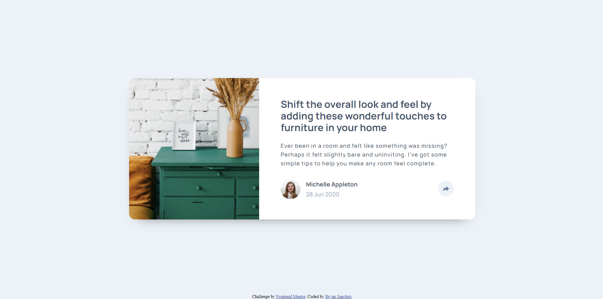

# Frontend Mentor - Article preview component solution

This is a solution to the [Article preview component challenge on Frontend Mentor](https://www.frontendmentor.io/challenges/article-preview-component-dYBN_pYFT). Frontend Mentor challenges help you improve your coding skills by building realistic projects. 

## Table of contents

- [Frontend Mentor - Article preview component solution](#frontend-mentor---article-preview-component-solution)
  - [Table of contents](#table-of-contents)
  - [Overview](#overview)
    - [The challenge](#the-challenge)
    - [Screenshot](#screenshot)
    - [Links](#links)
  - [My process](#my-process)
    - [Built with](#built-with)
    - [What I learned](#what-i-learned)
    - [Continued development](#continued-development)
    - [Useful resources](#useful-resources)
  - [Author](#author)
  - [Acknowledgments](#acknowledgments)

**Note: Delete this note and update the table of contents based on what sections you keep.**

## Overview

### The challenge

Users should be able to:

- View the optimal layout for the component depending on their device's screen size
- See the social media share links when they click the share icon

### Screenshot



### Links

- Solution URL: [Solution on Github](https://github.com/Bry-cmd/article-preview-component-master)
- Live Site URL: [Live Site](https://bry-cmd.github.io/article-preview-component-master/)

## My process

### Built with

- Semantic HTML5 markup
- CSS custom properties
- Flexbox
- CSS Grid
- JavaScript

### What I learned

My biggest learning for this challenge was how to create a popup or tooltip. Although it seemed kind of daunting trying to figure out how to make it, once I analyzed what was asked, it seemed more doable. Essentially, I created a wrapper containing the popup and all its contents. This is shown below.

```html
<div class="share-container">
  <div class="popup-wrapper">
    <div class="popup-block">
      <button class="share-txt">SHARE</button>
      <button class="facebook-btn btn-img"></button>
      <button class="twitter-btn btn-img"></button>
      <button class="pinterest-btn btn-img"></button>
    </div>
    <div class="popup-arrow"></div>
  </div>
  <button class="share-btn"></button>
</div>
```

I also enclosed the popup wrapper and share button in one div called share container. I did this so that the popup, which was a child of the share container, would be anchored to it. As a result, it would automatically move with it and I wouldn't have to tweak its position for responsive design. I set the popup-wrapper's position to absolute so that it would be anchored to the share container.

```css
div.share-container {
  position: relative;
}

div.popup-wrapper {
  position: absolute;
}
```

Once the popup was ready, I simply made the whole thing invisible by default but included another class, that would be added to the popup-wrapper class once the button was clicked, that made it visible.

```css
div.popup-wrapper {
  visibility: hidden;
}

.show {
  visibility: visible !important;
}
```

Once this was done, I just needed to add an event handler for a click event on the share button using JS.

```js
var shareBtn = document.querySelector("button.share-btn");

shareBtn.addEventListener("click", displayPopup);

function displayPopup() {
    var popup = document.querySelector("div.popup-wrapper");
    console.log("Clicked");
    popup.classList.toggle("show");
}
```

I also had to add another event handler for changing the button color, but this was something I already knew how to do so I won't include the code here.

### Continued development

In future projects, I hope to dive into more complex JS since my understanding of it is still very basic compared to that of HTML and CSS. I also hope to start using CSS frameworks, like Bootstrap, or preprocessors, like SASS, in order to improve my workflow. Finally, I hope to use more purposeful HTML tags in future projects since all of my projects thus far just use div for containers.

### Useful resources

- [w3schools](https://www.w3schools.com/) - This helped me a lot when it came to quickly reviewing functions of code which I forgot.
- [CSS Tricks](https://css-tricks.com/snippets/css/complete-guide-grid/) - This provided a very in-depth discussion on the use of CSS Grid and Flexbox, allowing me to use them to accomplish this challenge.

## Author

- Github - [Bry-cmd](https://github.com/Bry-cmd)
- Frontend Mentor - [@Bry-cmd](https://www.frontendmentor.io/profile/Bry-cmd)
- LinkedIn - [Bryan Sanchez](https://www.linkedin.com/in/bryan-sanchez-b316b7203/)

## Acknowledgments

Thank you so much to [LaplaceXD](https://github.com/LaplaceXD) for helping me figure out how to anchor the popup to the share button so that I don't have to tweak its position in the media queries.